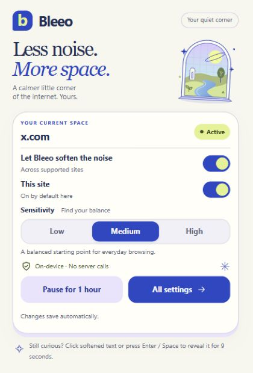

# Bleeo

### Soften the noise. Read on your terms.

Bleeo is an open-source Chrome and Edge extension that softens sensationalized language in news and social feeds. It blurs matched text in place, so you can choose when to read it while keeping the page usable.

**Introducing Bleeo, now public at [EpikHigh-AI](https://github.com/EpikHigh-AI).** Try the early preview, tell us what feels useful, and help shape a calmer browsing experience.

[Get started](#get-started) · [How it works](#how-it-works) · [Privacy](#privacy) · [Contribute](#contribute)



## A little more room to choose

Feeds compete for attention with urgency, outrage, and curiosity hooks. Bleeo adds a small pause between seeing that language and engaging with it.

- **Stay in control.** Click softened text to reveal it for 9 seconds. Keyboard users can focus it and press Enter or Space. The first click on a softened link reveals it; a second click while revealed opens the link.
- **Find your balance.** Choose low, medium, or high sensitivity, with guidance next to the control.
- **Take a break.** Pause a supported site for an hour and resume whenever you like.
- **Make it yours.** Switch filtering off globally or for a specific hostname. Restore a site's default preference from settings.
- **Know what's happening.** The popup shows the current hostname, explains whether filtering is active, and confirms saved changes. The toolbar badge counts softened text blocks on the page.
- **Keep text local.** Detection runs on your device, with no hosted classifier, telemetry, or tracking SDK.

Bleeo responds to wording. It does not judge a source's credibility, fact-check a claim, or classify a viewpoint.

## Get started

This is an early preview. The instructions below build the extension from source and load it into your browser.

You need **Node.js 22 or newer**, npm, and Chrome or Microsoft Edge.

```bash
git clone https://github.com/EpikHigh-AI/Bleeo.git
cd Bleeo
npm ci
npm run build
```

On Windows PowerShell, use `npm.cmd` in place of `npm` if your execution policy blocks `npm.ps1`.

1. Open `chrome://extensions` or `edge://extensions`.
2. Turn on **Developer mode**.
3. Choose **Load unpacked**, then select the generated `dist` folder inside your clone.
4. Pin Bleeo to your toolbar so its controls are easy to reach.
5. Open a supported site. If it was already open when you installed Bleeo, reload it.

Start with **Medium** sensitivity. Open the toolbar popup to see the current site's state, adjust filtering, or pause it. Changes save automatically and update open supported pages.

### Choose your sensitivity

| Setting | What to expect |
| --- | --- |
| Low | Softens the strongest signals; more text stays visible. |
| Medium | A balanced starting point for everyday browsing. |
| High | Softens more language; may also catch ordinary headlines. |

### Supported sites

| News | Social and video |
| --- | --- |
| CNN, BBC.com, The New York Times, Fox News, New York Post, The Guardian, The Washington Post, Google News | Reddit, X / Twitter, YouTube, Facebook, Instagram, Threads.net, TikTok, LinkedIn |

The extension runs on these domains and their subdomains. Other websites and browser settings pages are outside its scope; a site preference does not grant access to additional domains. Detection coverage varies with page layout.

## How it works

Bleeo collects candidate headlines, posts, and short text blocks, then scores them with local rules. Signals include alarm terms, fear appeals, outrage bait, urgency frames, curiosity hooks, repeated punctuation, and strong uppercase emphasis. Matched text is blurred without removing it from the page.

Clickbait filtering now recognizes specific hooks such as disbelief, promised reactions, withheld details, and teased list items—even without loud punctuation. It handles curly apostrophes and headlines split across HTML elements. Ordinary questions, explanatory titles, and numbered guides do not trigger filtering on those formats alone. See the [research sources and regression evaluation](docs/clickbait-filtering.md) for examples and limits.

The current detector targets **English wording** and is rules-based. It can miss sensational language or soften ordinary reporting. If the result feels too strong, lower sensitivity or turn filtering off for that site. A filtered phrase is a wording signal, not an assessment of truth or importance.

See the [detection roadmap](docs/detection-roadmap.md) for the approach and plans to evaluate an optional in-browser model. That model is future work; this preview uses local rules.

## Privacy

- Article text, post text, and browsing content are not sent to a server.
- Classification happens in the extension's local runtime.
- General preferences use browser sync storage and may sync through your signed-in browser account.
- Site preferences and pause state use local storage and stay in this browser profile.
- Host access is limited to the supported domains. `activeTab` lets the popup inspect the current tab; `storage` persists preferences; `offscreen` runs local classification separately from the page.
- There are no analytics, tracking SDKs, or telemetry dependencies.

## Contribute

We welcome bug reports, UX improvements, and detection examples at [EpikHigh-AI/Bleeo](https://github.com/EpikHigh-AI/Bleeo).

- [Report a bug or suggest an improvement](https://github.com/EpikHigh-AI/Bleeo/issues/new). Include your browser, site hostname, steps, and what you expected. Use public or invented text for detection examples.
- Help evaluate false positives and missed wording with focused test cases.
- Open a pull request with a clear description and relevant verification.

For development:

```bash
npm ci
npm run typecheck
npm test
npm run evaluate
npm run build
```

Use `npm run dev` to watch TypeScript changes. After a build, reload the extension from the extensions page and refresh the page you are testing. Changes to files in `public/` require restarting watch mode or running `npm run build` again.

### Project structure

```text
public/          Manifest, extension pages, styles, and icons
src/background/ Service worker, settings storage, message handling
src/content/    Page scanning, text wrapping, reveal behavior
src/offscreen/  Local classification entrypoint
src/popup/      Toolbar controls and current-site state
src/options/    Preferences and site defaults
src/shared/     Types, settings, validation, heuristics, UI helpers
tests/          Regression tests
docs/           Detection roadmap
```

## License and attribution

Bleeo is licensed under the [Apache License 2.0](LICENSE). Copyright 2026 jupram. Redistributed copies must retain the license and applicable [NOTICE](NOTICE) attribution.
